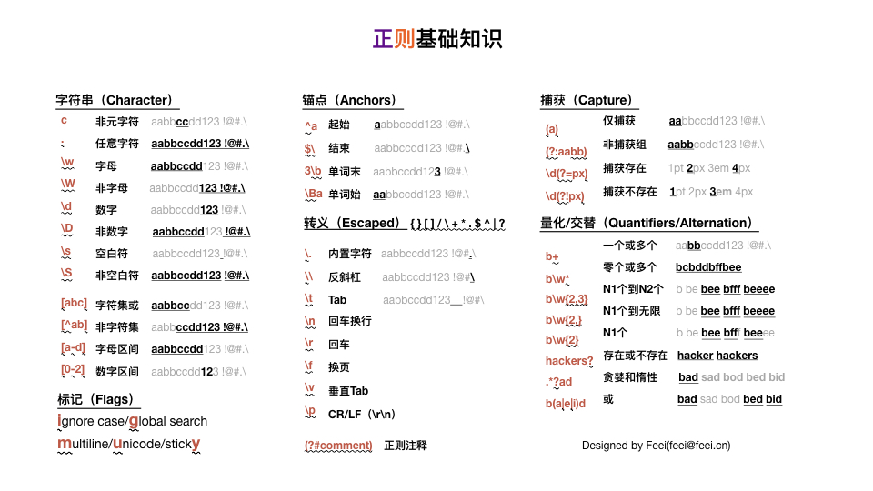

# 正则与安全
## 0x01 正则基础知识


## 0x02 正则编写思路
- 编写正则
  - 找锚点：找到标记位
  - 去噪点：去除可能存在的噪点
  - 取数据：取出需要的数据
- 列举用例数据
  - 正用例数据：需要匹配到的数据样例
  - 反用户数据：不需要匹配到的数据样例
- 验证正则
  - https://regexr.com/
  - 正则和正反用例数据填入
  - 确保正则中无红色标记
  - 正用例数据可以全部匹配到，反用例数据全部匹配不到
- 验证效果
  - 根据实际数据进行效果验证继而优化正则，循环如此

## 0x03 正则常见例子
#### 用户名
只允许字母、数字、下划线、横杠；最小四位数，最多16位数；
```java
^[a-z0-9_-]{4,16}$
```
- 数据处理前应全部转为小写
- 字符串两遍应去掉空格

#### 手机号
```java
(13|14|15|16|17|18|19)\d{9}[^\d]
```

```
TRUE
13512345678 15558077765

FALSE
12345678901 10000000000 135123456789
```

#### 中文
```java
[^\x00-\xff]
```

```java
TRUE
中文 测试 止介

FALSE
Chinese Test ZhiJie
```

#### 邮箱(RFC2822)
```[a-z0-9!#$%&'*+/=?^_`{|}~-]+(?:\.[a-z0-9!#$%&'*+/=?^_`{|}~-]+)*@(?:[a-z0-9](?:[a-z0-9-]*[a-z0-9])?\.)+[a-z0-9](?:[a-z0-9-]*[a-z0-9])?
```

```
TRUE
feei@feei.cn zhijie@meili-inc.com feei-007@gov.cn

FALSE
(feei@feei.cn
```

#### IP
**IPv4**
​```java
\b(?:(?:2(?:[0-4][0-9]|5[0-5])|[0-1]?[0-9]?[0-9])\.){3}(?:(?:2([0-4][0-9]|5[0-5])|[0-1]?[0-9]?[0-9]))\b
```

```java
TRUE
0.0.0.0 1.2.3.4 8.8.8.8 123.123.123.123 255.255.255.255

FALSE
0.0.x.0 1.3.4.5.6 123.123.123.256
```

**IPv6**
```java
(([a-fA-F0-9]{1,4}|):){1,7}([a-fA-F0-9]{1,4}|:)
```
```java
TRUE
1:2:3:4:5:6:7::  1:2:3:4:5:6:7:8
  1:2:3:4:5:6::  1:2:3:4:5:6::8
    1:2:3:4:5::  1:2:3:4:5::8
      1:2:3:4::  1:2:3:4::8
        1:2:3::  1:2:3::8
          1:2::  1:2::8
            1::  1::8
            1::  ::8
          1:2::  ::7:8
        1:2:3::  ::6:7:8
      1:2:3:4::  ::5:6:7:8
    1:2:3:4:5::  ::4:5:6:7:8
  1:2:3:4:5:6::  ::3:4:5:6:7:8
1:2:3:4:5:6:7::  ::2:3:4:5:6:7:8
1:2:3:4:5:6:7:8  1:2:3:4:5:6:7:8
1:2:3:4:5:6:7:8:9
abf2:1313:3213::3112
```

#### 颜色
**Hexadecimal**
```java
#(?:[a-f\d]{3}){1,2}\b
```

```
RIGHT #fff #FFF #Fff #ff004B
BAD   #f #ff #ffff #fffff #fffffff #ffg #fffffg
```

**RGB**
```java
rgb\((?:(?:\s*0*(?:25[0-5]|2[0-4]\d|1?\d?\d)\s*,){2}\s*0*(?:25[0-5]|2[0-4]\d|1?\d?\d)|\s*0*(?:100(?:\.0+)?|\d?\d(?:\.\d+)?)%(?:\s*,\s*0*(?:100(?:\.0+)?|\d?\d(?:\.\d+)?)%){2})\s*\)|hsl\(\s*0*(?:360|3[0-5]\d|[12]?\d?\d)\s*(?:,\s*0*(?:100(?:\.0+)?|\d?\d(?:\.\d+)?)%\s*){2}\)|(?:rgba\((?:(?:\s*0*(?:25[0-5]|2[0-4]\d|1?\d?\d)\s*,){3}|(?:\s*0*(?:100(?:\.0+)?|\d?\d(?:\.\d+)?)%\s*,){3})|hsla\(\s*0*(?:360|3[0-5]\d|[12]?\d?\d)\s*(?:,\s*0*(?:100(?:\.0+)?|\d?\d(?:\.\d+)?)%\s*){2},)\s*0*(?:1|0(?:\.\d+)?)\s*\)
```

```java
TRUE
rgb(0,0,0) RGB(124, 100, 0) rgb(255,255,255) Rgb( 0255, 00001, 02)
rgb(10%,10%,10%) rgb(100.0%, 2.5%, 0%) rgb(00010%, 0002%, 001%)
rgba(255 , 0 , 0, 0.5 ) rgba(1,1,1,0.255) rgba(0,0,0,0)
rgba(10%,10% , 10%, 0.2) rgba(10%, 0025.2%, 1%, 0.0001)
hsl(0,20%,100%) HsL(360,10% , 0.2% ) hsl(000350, 002%, 0004.1%)
hsla(140,2%,50%,0.2) hsla(0,0%,0%,0) hsla(001,002%,00001.2%,0000.254)

FALSE
rgb (0,0,0) rgba (0,0,0,0) rgb (0%,0%,0%) rgba (0%,0%,0%,0) hsl (0,0%,0%) hsla (0,0%,0%,0)
rgb(0,0,0,0) rgb(0,0) hsl(0,0%,0%,0) hsl(0,0%)
rgba(0,0,0) rgba(0,0,0,0,0) hsla(0,0%,0%) hsla(0,0%,0%,0,0)
rgb(256,0,0) rgb(100.2,0,0)
rgb(120%,10%,1%) hsl(200, 101%, 10%)
rgba(0,0,0,1.2) hsla(120, 50%, 50%, 1.3)
hsl(361,50%,50%) hsla(361,50%,50%,0.5)
hsl(1%,2%,3%) hsl(5,6,7)
rgb(255, 10%, 0) rgb(10%, 255, 0) rgba(10%, 255, 0, 0.3)
```

## 0x04 正则安全
> 正则主要的安全问题是绕过（Bypass）和拒绝服务（ReDoS）
> Bypass

#### 域名白名单（WooYun-2014-63321）
```javascript
var fu=$xss(decodeURIComponent($getQuery('fu')),'script'),
content=document.getElementById('content');
if(fu.search(/^http\:\/\/.*\.paipai.com($|(\/[^<>\'\"]*))/) > -1){
	var uin=$getUin(),
	sizes=$getQuery('size',fu).split('x');
	if(sizes&&sizes.length==2){
		content.style.width=sizes[0]+'px';
		content.style.height=sizes[1]+'px';
	}
	content.src=fu+(uin ? (fu.indexOf('?')>0 ? '&uin=':'?uin=')+uin  :'');
}else{
	content.src='http://www.paipai.com';
}
```

- `/^http\:\/\/.*\.paipai.com($|(\/[^<>\'\"]*))/`
- 限制了http开头和paipai.com结尾
- `.*`可以任意字符
- 构造`http://feei.cn/test_url?a=paipai.com`即可伪造

- 修复完的代码
```javascript
fu.search(/^http\:\/\/[^.]*\.paipai.com($|(\/[^<>\'\"]*))/)
```
- `[^.]`不允许在子域里面出现点
- 可通过将IP转十进制绕过，`http://www.baidu.com` -> `http://115.239.210.27` -> `http://1945096731`
- 构造`http://1945096731/test_url?a=paipai.com`即可伪造

```python
# -*- coding: utf-8 -*-
"""
IP & Decimal Converter
@author Feei(feei#feei.cn)
"""

def ip2decimal(ip_host):
    items = [int(x) for x in ip_host.split(".")]
    return sum([items[i] << [24, 16, 8, 0][i] for i in range(4)])

def decimal2ip(ip_decimal):
    return ".".join([str(ip_decimal >> x & 0xff) for x in [24, 16, 8, 0]])

ip = '115.239.210.27'
decimal = 1945096731

assert ip2decimal(ip) == decimal
assert decimal2ip(decimal) == ip
```

#### 路径穿越
在Buttle中出现的路径穿越漏洞[CVE-2018-3766](https://hackerone.com/reports/358112)
```javascript
var url = req.url;
    if(/\.md$/i.test(url) || /\.markdown/i.test(url)) {
      fs.exists(j(dir, url), function(exists) {
        if(exists) {
          fs.readFile(j(dir, url), {encoding: 'utf8'}, function(err, data) {
            if(err) { return res.end(err.message); }
            res.end(wrapInHtml(md(data)));
          });
        } else {
          next();
        }
      });
    } else {
      next();
}
```
- `/\.md$/i`限制了必须以`.md`后缀结尾
- `/\.markdown/i`仅限制了包含`.markdown`
- 则可以构造`a.markdown/../../../../../etc/passwd`来进行路径穿越从而导致任意文件读取

#### Struts2系列命令执行
黑名单形式正则不可取
```xml
<param name="excludeParams">dojo\..*</param>

<param name="excludeParams">dojo\..*,^struts\..*</param>

<param name="excludeParams">dojo\..*,^struts\..*,^session\..*,^request\..*,^application\..*,^servlet(Request|Response)\..*,parameters\...*</param>

<param name="excludeParams">^dojo\..*,^struts\..*,^session\..*,^request\..*,^application\..*,^servlet(Request|Response)\..*,^parameters\..*,^action:.*,^method:.*</param>

<param name="excludeParams">^class\..*,^dojo\..*,^struts\..*,^session\..*,^request\..*,^application\..*,^servlet(Request|Response)\..*,^parameters\..*,^action:.*,^method:.*</param>

<param name="excludeParams">^class\..*,^dojo\..*,^struts\..*,^session\..*,^request\..*,^application\..*,^servlet(Request|Response)\..*,^parameters\..*,^action:.*,^method:.*</param>+ <param name="excludeParams">(.*\.|^)class\..*,^dojo\..*,^struts\..*,^session\..*,^request\..*,^application\..*,^servlet(Request|Response)\..*,^parameters\..*,^action:.*,^method:.*</param>

```

ReDoS
类似于`(a+)+`这类重复匹配的正则会导致耗时异常旧。
```javascript
var r = /([a-z]+)+$/
var s = 'aaaaaaaaaaaaaaaaaaaaaaaaaaaaaaaaaaaaaaaaaaaaaaaaaaaaaaaa!'

console.log('Running regular expression... please wait')
console.time('benchmark')

r.test(s)

console.timeEnd('benchmark')
```

常见ReDoS
- `(a+)+`
- `([a-zA-Z]+)*`
- `(a|aa)+`
- `(a|a?)+`
- `(.*a){x} | for x > 10`

Email
Regex: `^([0-9a-zA-Z]([-.\w]*[0-9a-zA-Z])*@(([0-9a-zA-Z])+([-\w]*[0-9a-zA-Z])*\.)+[a-zA-Z]{2,9})$`
Payload: `a@aaaaaaaaaaaaaaaaaaaaaaaaaaaaaaa!`


