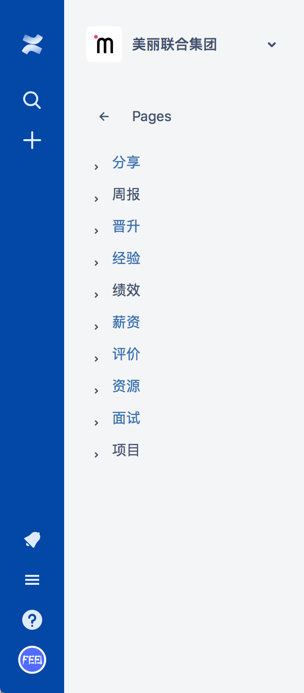

# 知识管理体系

## 背景

若出现过以下问题，则就遇到了知识管理的问题。

- 看过某篇文章，记不清细节，又去Google？
- 公积金号码忘记了得去问人事？
- 想知道某一周的工作内容，得去邮件中搜索？

这些内容都分散各个地方，没有统一的收集起来就行整理并沉淀，也就无法实现定期回顾就行改进提升。

## 方式

- 众多笔记软件
  - 印象笔记
  - 有道笔记
  - OneNote
  - 麦库记事
  - 为知笔记
- wiki系统
  - GitBook
  - MediaWiki
  - Confluence

在尝试试用了各类软件后，各有弊端啊，要么没有**树形结构**方便管理、要么**书写或查看体验**不好、要么**界面**还停留在上世纪。

最终选择了商业程序Confluence，大型企业几乎都在使用这套程序作为内部wiki，在多人协作、体系化内容管理和使用体验、界面效果上和其它软件不是一个阶层的。
当然价格也不是一个阶层，高达每年100美金的费用让我望而止步，于是走上了破解的道路，在自己服务器上搭建破解版本，用了超过一年后不知什么原因导致数据丢失。
5d/m/p

于是忍痛买了在线版本，除了访问速度慢了点，没找到任何一个缺点。

## 实践

整体分为了几个Space（空间）：Feei（个人）、美丽联合集团（公司）、知识库、漏洞库。

#### Feei（个人）

#### 美丽联合集团（公司）

#### 知识库

#### 漏洞库

## 结论
